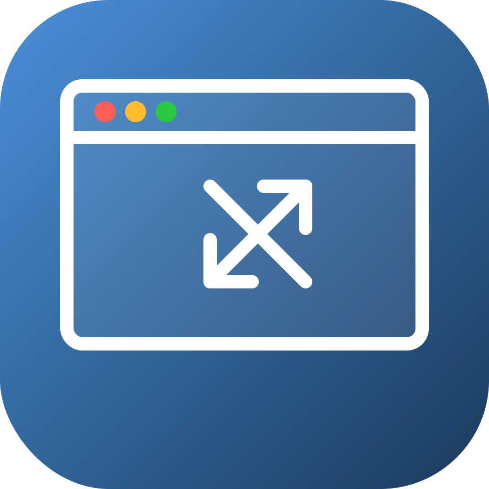

<p align="center">
  
</p>

<h1 align="center">szn - Window Resizer</h1>

<p align="center"><strong>Save a window size once. Apply it to every new window — automatically.</strong></p>

[](https://github.com/realgarit/szn/actions/workflows/build.yml)
[](https://github.com/realgarit/szn/releases/latest)
[](LICENSE)
[](https://github.com/realgarit/szn)
[](https://github.com/realgarit/szn/releases)

---

A free, open-source macOS menu bar app that remembers your preferred window sizes per app and automatically applies them to every new window. No subscriptions, no paywalls — just a small native utility that does exactly what it should.

## Features

- **Save & auto-apply** — Size a window once, szn applies it to every new window of that app
- **Size or Size + Position** — Choose to save just dimensions, or the exact screen placement too
- **Per-app profiles** — Each app gets its own saved layout
- **Instant** — Native Swift + macOS Accessibility API, zero overhead
- **Menu bar only** — Lives in the menu bar, no dock icon, no clutter
- **Launch at login** — Set it and forget it
- **Global toggle** — Disable szn temporarily without removing your profiles

## Installation

### Download

Grab the latest `.dmg` from the [Releases](https://github.com/realgarit/szn/releases/latest) page.

> **Note:** szn is not code-signed with an Apple Developer certificate.
> On first launch, macOS Gatekeeper will block it. To open:
>
> 1. Open the `.dmg` and drag `szn.app` to **Applications**
> 2. Open Terminal and run: `xattr -cr /Applications/szn.app`
> 3. Right-click (or Control-click) `szn.app` → **Open** → click **Open**
>
> Step 2 removes the macOS quarantine flag, which is required for accessibility
> permissions to work correctly with unsigned apps on macOS Sequoia and later.

### Build from source

```bash
# Install xcodegen if you don't have it
brew install xcodegen

# Clone and build
git clone https://github.com/realgarit/szn.git
cd szn
xcodegen generate
xcodebuild -project szn.xcodeproj -scheme szn -configuration Release
```

## Usage

1. **Grant accessibility permission** — szn will prompt you on first launch. Go to **System Settings → Privacy & Security → Accessibility** and enable szn.

2. **Size your window** — Open any app and resize its window exactly how you want it.

3. **Save it** — Click the szn icon in the menu bar → **Save Size for Current App** (or Save Size & Position).

4. **Done.** Every new window of that app will automatically get your saved dimensions.

### Menu bar options

| Action | Description |
|--------|-------------|
| **Save Size for Current App** | Saves the focused window's width and height |
| **Save Size & Position** | Saves dimensions + screen position |
| **Profiles submenu** | View, toggle, apply, or remove saved profiles |
| **Settings** | Launch at login, global enable/disable |

## How it works

szn uses the macOS Accessibility API (`AXUIElement`) to:

1. **Read** the focused window's frame when you save a profile
2. **Observe** new window creation events via `AXObserver`
3. **Apply** saved dimensions to new windows as they appear

All profiles are stored locally in `UserDefaults` — no cloud, no telemetry, no network calls.

## Requirements

- macOS 13 (Ventura) or later
- Accessibility permission (prompted on first launch)

## Contributing

Contributions are welcome! Feel free to open an issue or submit a pull request.

1. Fork the repository
2. Create your feature branch (`git checkout -b feature/my-feature`)
3. Commit your changes
4. Push to the branch
5. Open a Pull Request
